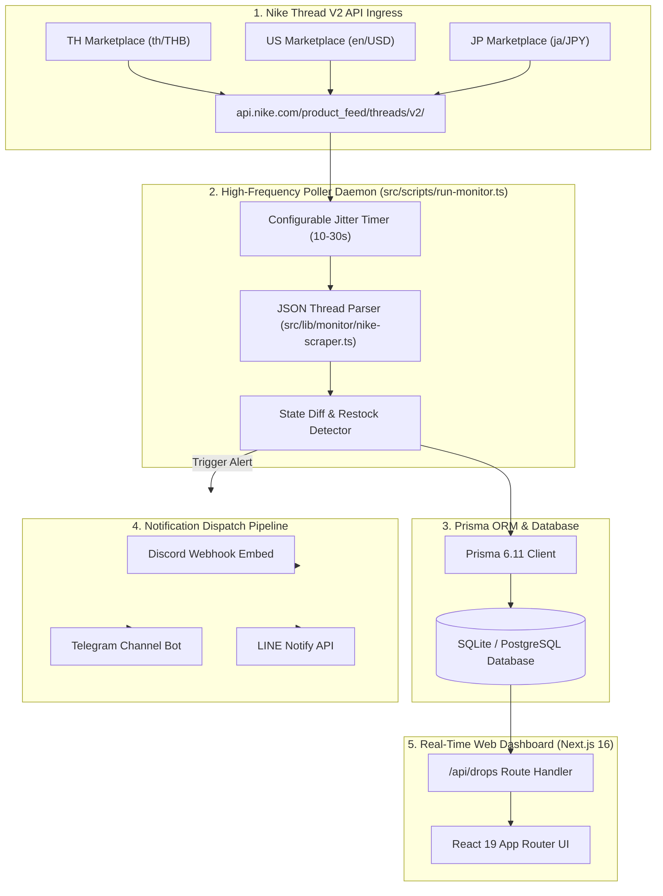
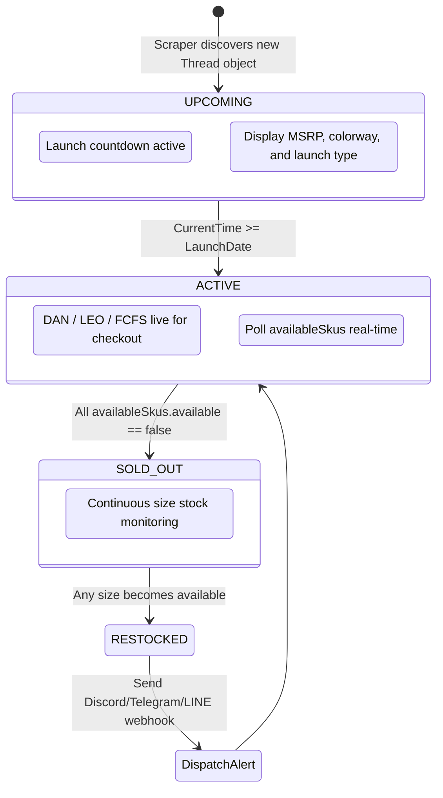

# Nike SNKRS Tracker Architecture Specification

## 🏗️ 1. High-Level Architectural Design

**Nike SNKRS Tracker (SNKRS Radar)** combines an event-driven polling daemon, high-performance REST APIs, and a modern Next.js 16 Web Dashboard.

---

## ⚡ 2. Drop Lifecycle State Machine

---

## 🛡️ 3. Anti-Detection & Jitter Strategy

To ensure zero downtime and prevent IP bans from Nike CDN gateways:
1. **Randomized Request Jitter:** Intervals vary randomly between $T \pm 20\%$ seconds.
2. **User-Agent Fingerprint Rotation:** Rotates modern Chrome / Safari headers.
3. **Selective Query Parameters:** Queries strictly required fields (`productInfo`, `publishedContent`, `skus`) to minimize payload bandwidth.
