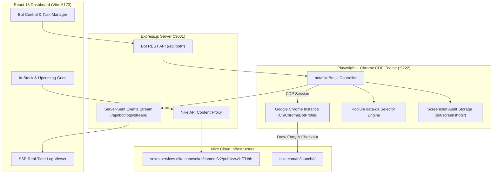
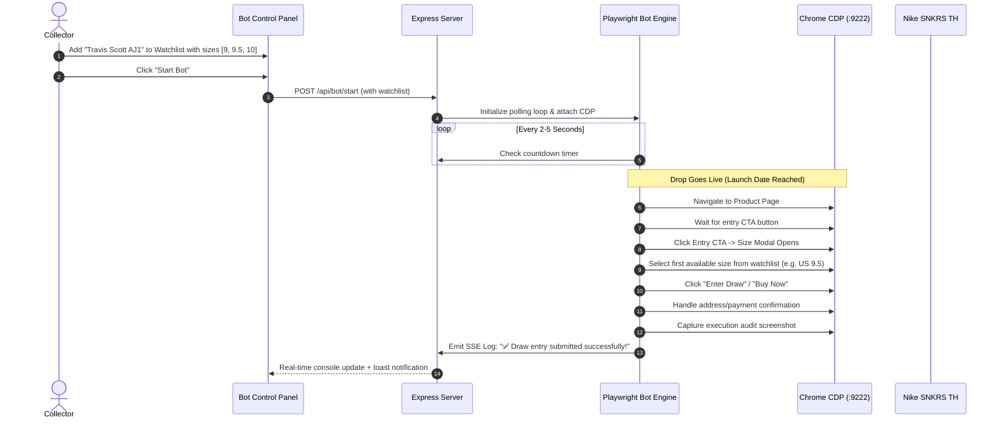

# Nike SNKRS Tracker & Auto-Buy Bot System Architecture

## 🏗️ 1. High-Level Architectural Design

**Nike SNKRS Tracker** is engineered as a three-tier architecture:
1. **Presentation Layer:** React 18 SPA built with Vite and Tailwind CSS.
2. **Gateway & API Proxy:** Express.js Node server handling Nike API aggregation and SSE log streaming.
3. **Automation Engine:** Playwright connecting via Chrome DevTools Protocol (CDP) on port 9222 to control authentic browser sessions.

---

## 🎯 2. Nike Podium Design-System Selector Mapping

To ensure resilience against frequent CSS obfuscation, `bot/nikeBot.js` targets Nike's stable `data-qa` attributes:

| Intent | Primary Selector (`data-qa`) | Fallback Selectors |
| :--- | :--- | :--- |
| **Entry CTA** | `[data-qa="feed-card-cta"]`, `[data-qa="buy-now-button"]` | `button:has-text("เข้าร่วม")`, `button:has-text("ซื้อเลย")`, `button:has-text("Enter Draw")` |
| **Size Selector** | `[data-qa="size-selector"]` | `[data-qa="size-grid-modal"]`, `button[data-qa*="size"]` |
| **Draw Submit** | `[data-qa="draw-entry-button"]` | `button:has-text("ยืนยัน")`, `button:has-text("Submit Entry")` |
| **Checkout Next** | `[data-qa="save-and-continue-button"]` | `button:has-text("ดำเนินการต่อไป")` |
| **Order Place** | `[data-qa="order-review-submit-button"]` | `button:has-text("สั่งซื้อ")`, `button:has-text("Place Order")` |

---

## 🤖 3. Bot State Machine & Execution Flow

