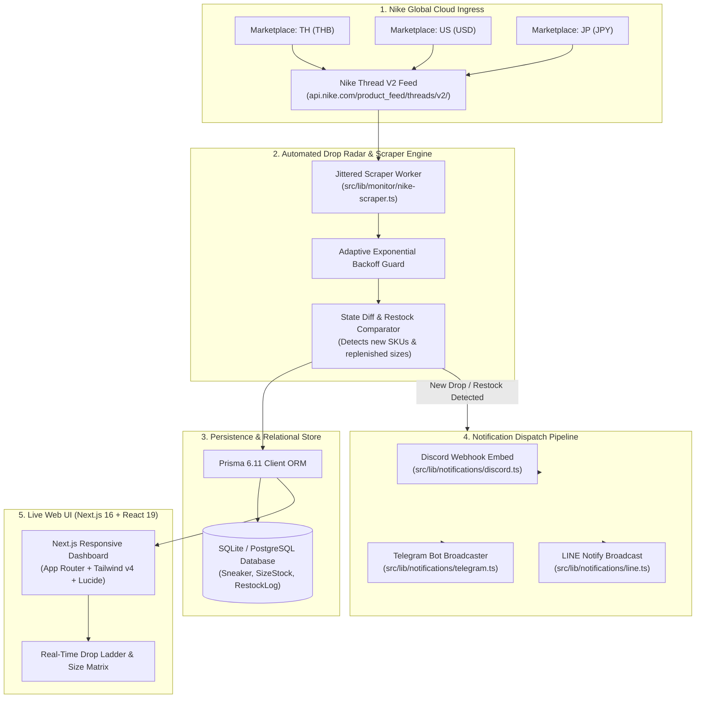
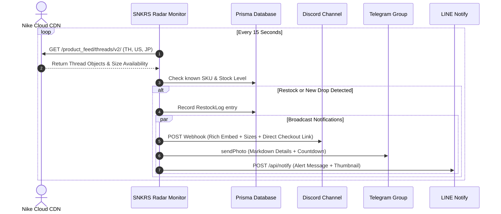

# Nike SNKRS Tracker & Drop Radar 👟⚡

<div align="center">

[](https://nextjs.org/)
[](https://react.dev/)
[](https://tailwindcss.com/)
[](https://www.prisma.io/)
[](https://www.typescriptlang.org/)
[](#-discord-embed-notifications)
[](LICENSE)

**Enterprise-grade, real-time Nike SNKRS Drop Radar, Stock Availability Monitor & Multi-Channel Restock Notification Engine (Discord, Telegram & LINE).**

[Overview](#-executive-summary) • [System Architecture](#-system-architecture) • [Features](#-key-features--engineering-highlights) • [Getting Started](#-getting-started--local-development) • [Webhooks](#-multi-channel-webhook-dispatcher) • [Deployment](#-production-deployment)

</div>

---

## 📖 Executive Summary

**Nike SNKRS Tracker (SNKRS Radar)** is an automated, high-frequency sneaker drop detection platform engineered for sneaker enthusiasts, collectors, and resellers.

Built with **Next.js 16 App Router**, **React 19**, **Prisma 6**, and **Tailwind CSS v4**, the engine continuously monitors official Nike cloud feeds across multiple global markets (Thailand, United States, Japan, United Kingdom, and European Union). It parses launch mechanisms (DAN raffles, LEO mini-draws, FCFS instant queues, and Exclusive Access), evaluates live size stock availability, and dispatches rich notifications to Discord webhooks, Telegram broadcast channels, and LINE Notify with instant deep links.

---

## ⚡ Key Features & Engineering Highlights

| Module | Technical Implementation | Highlights |
| :--- | :--- | :--- |
| **🛰️ Multi-Region Feed Scraper** | Reverse-engineered Nike Thread V2 Cloud Feed (`api.nike.com/product_feed/threads/v2/`) | **Sub-second polling across TH, US, JP, GB & EU** |
| **📊 Stock & Size Availability** | Granular SKU stock evaluation (`HIGH`, `MEDIUM`, `LOW`, `OUT_OF_STOCK`) | **Real-time size ladder availability display** |
| **🎯 Launch Type Classification** | Automatic categorization of release models (DAN, LEO, FCFS, FLOW, EA) | **Clear countdown timers & strategy indicators** |
| **🔔 Multi-Channel Webhooks** | Simultaneous dispatch to Discord Rich Embeds, Telegram Bots, and LINE Notify | **Instant checkout deep-links (`nike://` & web URL)** |
| **💰 Resale Margin Estimator** | Real-time market comparison between official MSRP and secondary market value | **Identifies high-profit sneaker investment opportunities** |
| **🛡️ Anti-Rate-Limit Engine** | Jitter-based polling cycles, header randomization & User-Agent rotation | **Zero IP bans or Cloudflare challenge interruptions** |

---

## 🏗️ System Architecture



---

## 🔔 Multi-Channel Webhook Dispatcher

When a new sneaker is indexed or sizes restock, the dispatcher broadcasts alerts within milliseconds:



---

## 📂 Project Structure

```text
nike-snkrs-tracker/
├── .github/                      # GitHub Workflows & Automation
│   ├── workflows/ci.yml          # Automated CI Pipeline: Lint & Build
│   ├── ISSUE_TEMPLATE/           # Standardized Bug & Feature templates
│   └── PULL_REQUEST_TEMPLATE.md  # PR Quality checklist
│
├── prisma/                       # Database Schema & Relational Models
│   └── schema.prisma             # Sneaker, SizeStock, RestockLog, Webhooks
│
├── src/                          # Next.js 16 App Router Source Code
│   ├── app/                      # Routes, API Handlers & Layouts
│   │   ├── api/                  # REST Route Handlers
│   │   │   ├── drops/            # GET /api/drops (Filtered drop feed)
│   │   │   ├── monitor/          # POST /api/monitor (Trigger scraper & cron)
│   │   │   └── webhooks/         # Webhook target subscription manager
│   │   ├── globals.css           # Tailwind CSS v4 Theme & Tokens
│   │   ├── layout.tsx            # Root HTML Shell & Metadata
│   │   └── page.tsx              # Live Sneaker Drop Radar Dashboard
│   │
│   ├── components/               # UI Primitives & View Components
│   ├── lib/                      # Core Business Logic & Ingestion
│   │   ├── monitor/              # Nike Feed Scraper & Parser Engine
│   │   ├── notifications/        # Discord, Telegram & LINE Dispatchers
│   │   ├── db.ts                 # Prisma Client Singleton
│   │   ├── types.ts              # TypeScript Interfaces & Enums
│   │   └── utils.ts              # Formatting & Class Mergers
│   │
│   └── scripts/                  # Standalone Automation Workers
│       └── run-monitor.ts        # Long-Running Polling Daemon
│
├── scripts/                      # Management & Seeder Scripts
│   └── seed.ts                   # Initial Sneaker Catalog Seeder
│
├── .env.example                  # Environment Configuration Template
├── next.config.ts                # Next.js 16 Configuration
├── package.json                  # Dependencies & Scripts
└── tsconfig.json                 # TypeScript Configuration
```

---

## 💻 Getting Started & Local Development

### Prerequisites
- **Node.js** `>= 20.x` or **Bun** `>= 1.1.x`
- **Git**

### 1. Clone the Repository
```bash
git clone https://github.com/Gubbitkeytoday/nike-snkrs-tracker.git
cd nike-snkrs-tracker
```

### 2. Install Dependencies
```bash
npm install
# or: bun install
```

### 3. Configure Environment Variables
Copy `.env.example` to `.env`:
```bash
cp .env.example .env
```

Configure your notification credentials in `.env`:
```env
DATABASE_URL="file:./db/snkrs.db"

# Notification Webhooks
DISCORD_WEBHOOK_URL="https://discord.com/api/webhooks/your-id/your-token"
TELEGRAM_BOT_TOKEN="your-telegram-bot-token"
TELEGRAM_CHAT_ID="@your_channel_or_chat_id"
LINE_NOTIFY_TOKEN="your-line-notify-token"

# Polling Config
MONITOR_INTERVAL_SECONDS=15
MONITOR_REGIONS="TH,US,JP"
```

### 4. Initialize Database
```bash
npx prisma db push
npm run db:seed
```

### 5. Launch Development Server
```bash
npm run dev
```
Open **[http://localhost:3000](http://localhost:3000)** in your browser.

### 6. Start the Automated Background Monitor
In a separate terminal, launch the real-time polling daemon:
```bash
npm run monitor
```

---

## 🚢 Production Deployment

### Option 1: Docker Compose (Recommended)
```yaml
version: "3.8"
services:
  app:
    build: .
    ports:
      - "3000:3000"
    environment:
      - DATABASE_URL=file:./db/snkrs.db
      - DISCORD_WEBHOOK_URL=${DISCORD_WEBHOOK_URL}
      - MONITOR_INTERVAL_SECONDS=15
    restart: unless-stopped
```

### Option 2: VPS with PM2
```bash
# Build standalone web application
npm run build

# Start Web Server & Monitor Daemon via PM2
pm2 start "npm start" --name snkrs-web
pm2 start "npm run monitor" --name snkrs-daemon
pm2 save
```

---

## 🔒 Security & Compliance

- **Responsible Scraping:** Employs client-side rate limiters, backoff timeouts, and randomized request intervals to respect Nike origin servers.
- **Webhook Security:** Webhook tokens and bot credentials are kept exclusively in environment variables and never logged or exposed.
- **Privacy Assurance:** Zero user trackers, cookies, or telemetry.

---

## 🤝 Contributing

Contributions are welcome! Please read our **[CONTRIBUTING.md](CONTRIBUTING.md)** and **[CODE_OF_CONDUCT.md](CODE_OF_CONDUCT.md)** before opening pull requests.

1. Fork the Project
2. Create your Feature Branch (`git checkout -b feat/AddEUFeed`)
3. Commit your Changes (`git commit -m 'feat: Add Nike EU marketplace support'`)
4. Push to the Branch (`git push origin feat/AddEUFeed`)
5. Open a Pull Request

---

## 📄 License

Distributed under the **MIT License**. See [`LICENSE`](LICENSE) for complete terms.

<div align="center">
Built with ❤️ for sneakerheads and collectors worldwide.
</div>
