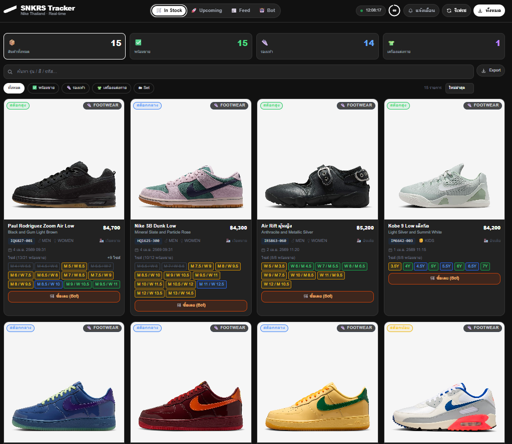
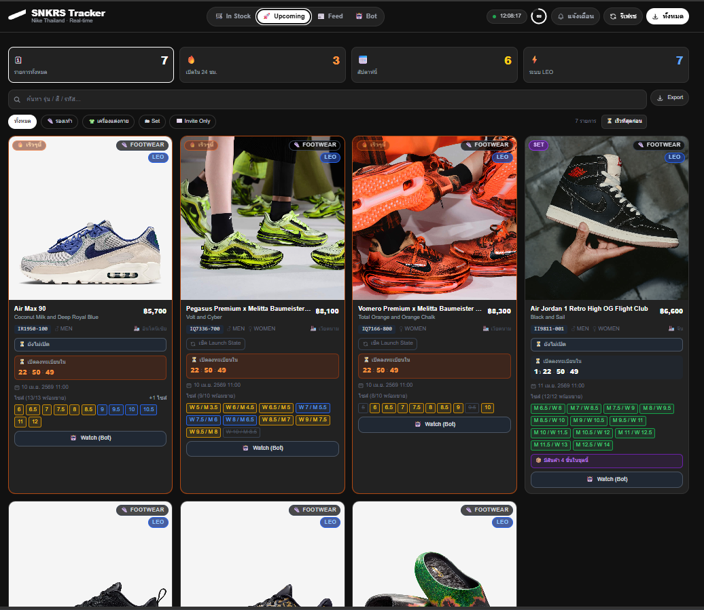
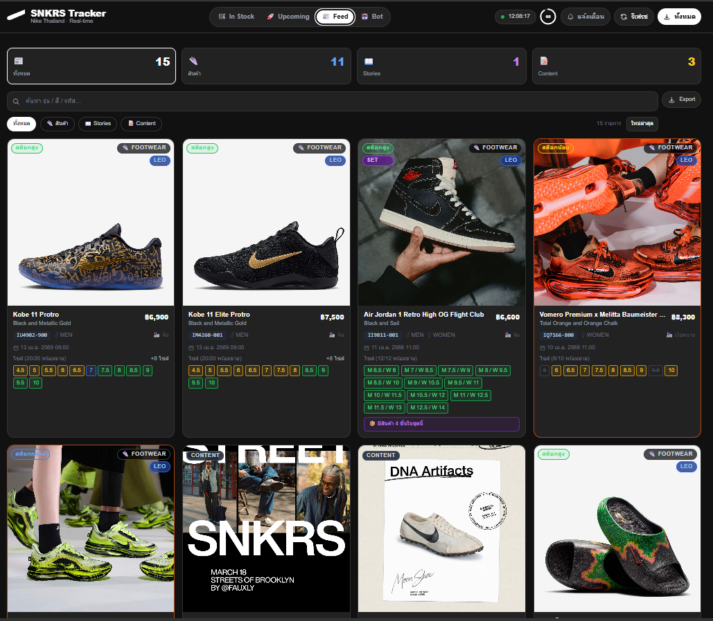
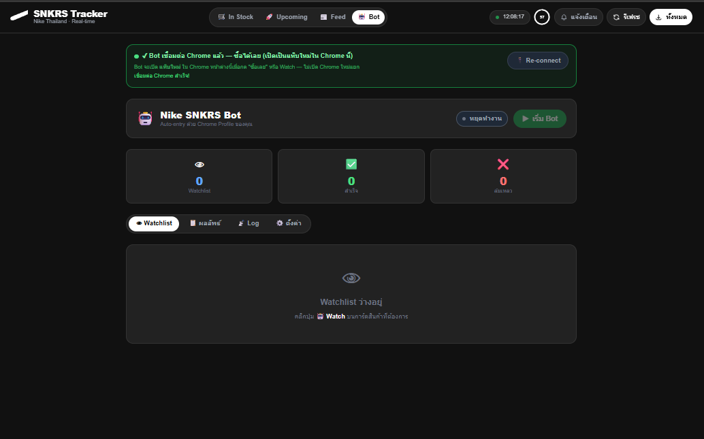
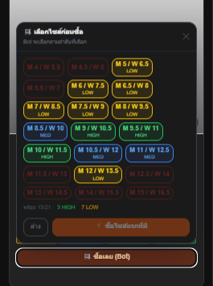
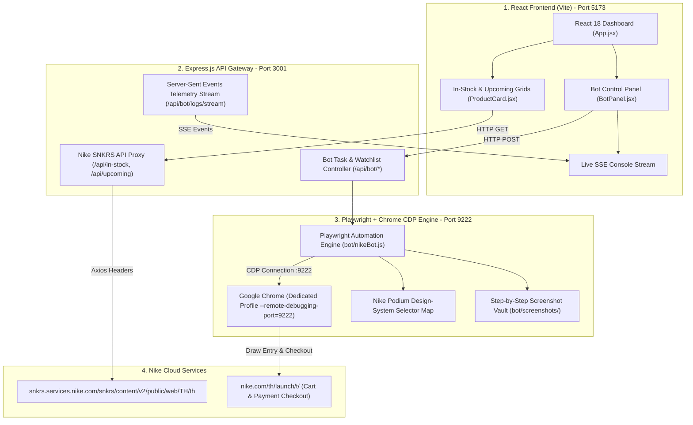
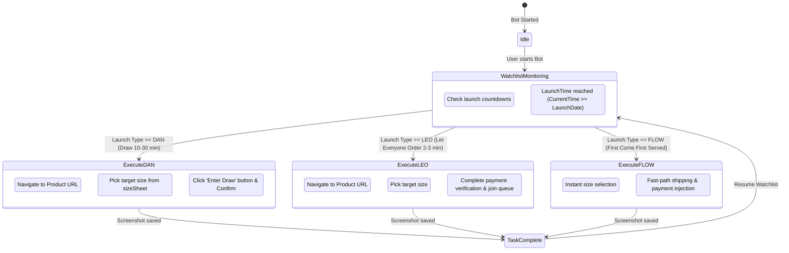

# Nike SNKRS Tracker & Auto-Buy Bot 👟⚡

<div align="center">

[](https://react.dev/)
[](https://vitejs.dev/)
[](https://tailwindcss.com/)
[](https://expressjs.com/)
[](https://playwright.dev/)
[](LICENSE)

**Enterprise-grade, real-time Nike SNKRS Thailand Drop Radar, Stock Monitor & Playwright Auto-Entry Bot with Chrome DevTools Protocol (CDP) integration.**

[Overview](#-executive-summary) • [System Architecture](#-system-architecture) • [Visual Gallery](#-visual-gallery) • [Key Capabilities](#-key-features--engineering-highlights) • [Getting Started](#-getting-started--local-development) • [Bot Setup Guide](#-chrome-debugging--auto-buy-bot-setup)

</div>

---

## 📖 Executive Summary

**Nike SNKRS Tracker & Auto-Buy Bot** is a high-performance web scraping and automation platform designed specifically for the **Nike SNKRS Thailand (`nike.com/th/launch`)** ecosystem.

The system combines a reactive **React 18 + Vite** dashboard with an **Express.js API proxy** and a specialized **Playwright + Chrome DevTools Protocol (CDP)** auto-entry bot. It tracks in-stock items, upcoming drops, and exclusive editorial feeds in real-time, monitors size-level availability, and automates sneaker draw entries (DAN, LEO, and FLOW) using authentic Chrome profiles to bypass anti-bot detections.

---

## 📸 Visual Gallery

<details open>
<summary><b>Click to expand application dashboard previews</b></summary>
<br>

| 🛒 In Stock — Available Products | 🚀 Upcoming — Scheduled Launches |
| :---: | :---: |
| [](docs/screenshots/instock.png)<br>**In Stock Catalog.** Live stock availability, prices, style codes, and instant checkout. | [](docs/screenshots/upcoming.png)<br>**Upcoming Releases.** Launch countdown timers, launch methods (DAN/LEO/FLOW), and watchlist triggers. |

| 📰 SNKRS Editorial Feed | 🤖 Bot Control & Telemetry Panel |
| :---: | :---: |
| [](docs/screenshots/feed.png)<br>**Editorial Feed.** High-resolution story cards, behind-the-design articles, and drop previews. | [](docs/screenshots/bot.png)<br>**Bot Control Center.** Real-time task manager, Chrome CDP debugger, and live SSE execution logs. |

| 👟 Interactive Size Picker |
| :---: |
| [](docs/screenshots/sizepicker.png)<br>**Size Matrix.** US Men / Women size selection, stock level indicators, and watchlist size assignment. |

</details>

---

## ⚡ Key Features & Engineering Highlights

| Module | Technical Implementation | Highlights |
| :--- | :--- | :--- |
| **🛰️ Real-Time SNKRS Scraping** | Express.js proxy requesting official Nike SNKRS Thailand Public Content API | **Bypasses CORS & parses nested thread objects** |
| **🤖 Playwright + CDP Bot** | Direct connection to Chrome Remote Debugging port (`9222`) | **Reuses authentic logged-in session cookies with zero Cloudflare blocks** |
| **🎯 Multi-Launch Support** | Dedicated automation strategies for **DAN** (Raffle), **LEO** (Mini-Draw), and **FLOW** (FCFS) | **Sub-second size selection, cart injection, and payment entry** |
| **📡 Real-Time SSE Log Stream** | Server-Sent Events (SSE) streaming live bot actions directly to UI | **Real-time execution feedback and step-by-step screenshots** |
| **👟 Size Availability Matrix** | Granular SKU stock parsing per US size | **Quick size picker with fallback size options** |
| **📊 Data Export Engine** | Client-side CSV and Excel generation utility | **Export active drops, style codes, and launch dates with one click** |

---

## 🏗️ System Architecture



---

## 🎯 Drop Types & Automation Strategies



---

## 📂 Project Structure

```text
nike-snkrs-tracker/
├── .github/                      # GitHub Issue & PR Templates
│   ├── ISSUE_TEMPLATE/           # Standardized Bug & Feature templates
│   ├── PULL_REQUEST_TEMPLATE.md  # PR Quality assurance checklist
│   ├── CODEOWNERS                # Repository Maintainer Directives
│   └── dependabot.yml            # Automated Dependency Security
│
├── bot/                          # Playwright Automation Subsystem
│   ├── nikeBot.js                # Master Nike SNKRS Playwright CDP Bot Engine
│   └── screenshots/              # Step-by-Step Visual Execution Audit Logs
│
├── docs/                         # Architecture & Documentation
│   ├── ARCHITECTURE.md           # Deep Technical Design & Selector Mapping
│   ├── DEPLOYMENT.md             # Production Deployment Runbook
│   └── screenshots/              # High-Resolution UI Showcase Images
│
├── src/                          # React 18 Frontend Application
│   ├── components/               # Modular UI Components
│   │   ├── BotPanel.jsx          # Bot Control Center & SSE Log Viewer
│   │   ├── ProductCard.jsx       # In-Stock & Upcoming Sneaker Card
│   │   ├── FeedCard.jsx          # Editorial Story Card
│   │   ├── SizePicker.jsx        # Interactive Size Selection Grid
│   │   ├── LaunchCountdown.jsx   # High-Precision Drop Countdown Timer
│   │   ├── Header.jsx            # Top Navigation & Quick Stats
│   │   ├── FilterBar.jsx         # Search, Sort, and Category Filter
│   │   ├── ImageLightbox.jsx     # Fullscreen Sneaker Image Viewer
│   │   ├── ThreadModal.jsx       # Detailed Product & Size Breakdown Modal
│   │   └── ExportButton.jsx      # CSV/Excel Data Exporter
│   ├── App.jsx                   # Root Application Container
│   ├── main.jsx                  # React DOM Entry Point
│   └── index.css                 # Tailwind CSS Directives & Custom Scrollbars
│
├── server.js                     # Express.js API Gateway & Scraper Proxy
├── start_chrome_debug.bat        # Windows Batch Script to Launch Chrome CDP
├── start_chrome_debug.ps1        # PowerShell Script to Launch Chrome CDP
├── vite.config.js                # Vite Build & Proxy Configuration
├── tailwind.config.js            # Tailwind CSS Theme Customizations
├── package.json                  # Dependencies & Execution Scripts
└── README.md                     # Executive Documentation
```

---

## 💻 Getting Started & Local Development

### Prerequisites
- **Node.js** `>= 18.x`
- **Google Chrome** (for automated bot mode)
- **Git**

### 1. Clone the Repository
```bash
git clone https://github.com/Gubbitkeytoday/nike-snkrs-tracker.git
cd nike-snkrs-tracker
```

### 2. Install Dependencies
```bash
npm install
```

### 3. Launch Development Server
```bash
# Starts Express backend (:3001) and Vite frontend (:5173) concurrently
npm run dev
```
Open **[http://localhost:5173](http://localhost:5173)** in your browser.

---

## 🤖 Chrome Debugging & Auto-Buy Bot Setup

To allow the bot to checkout on your behalf without triggering bot challenges:

### Step 1: Launch Chrome with Remote Debugging
Run the included launcher script (make sure all existing Chrome windows are closed first):

```powershell
# Windows PowerShell
.\start_chrome_debug.ps1
```
*Or double-click `start_chrome_debug.bat`.*

This opens Chrome on port `9222` with a dedicated profile directory (`C:\ChromeBotProfile`).

### Step 2: Log into Nike SNKRS
In the opened Chrome browser window:
1. Navigate to **[https://www.nike.com/th/launch](https://www.nike.com/th/launch)**
2. Log in with your Nike Member account
3. Save your default shipping address and payment method

### Step 3: Add Items to Watchlist & Start Bot
1. Open the Tracker Dashboard at **`http://localhost:5173`**
2. In the **Upcoming** or **Feed** tabs, click **Add to Bot Watchlist** on your desired sneaker
3. Select your target US sizes (e.g. `US 9, 9.5, 10`)
4. In the **Bot Panel**, click **Start Bot**
5. The bot will automatically monitor countdowns, navigate to the drop page, select size, and submit draw entry upon release!

---

## 🔒 Anti-Detection & Security Principles

- **Zero Headless Detection:** The bot connects via CDP to real Google Chrome instances rather than virtual headless browsers, maintaining genuine GPU fingerprints and audio contexts.
- **Podium Selector Resilience:** Selectors utilize Nike's stable `data-qa` attributes which survive weekly CSS class obfuscation deploys.
- **Local Credentials:** Login cookies and payment information remain securely inside your local Chrome profile and are never transmitted to any external server.

---

## 🤝 Contributing

Contributions are welcome! Please read our **[CONTRIBUTING.md](CONTRIBUTING.md)** and **[CODE_OF_CONDUCT.md](CODE_OF_CONDUCT.md)** before submitting pull requests.

---

## 📄 License

Distributed under the **MIT License**. See [`LICENSE`](LICENSE) for complete terms.

<div align="center">
Built with ❤️ for the sneakerhead and collector community.
</div>
